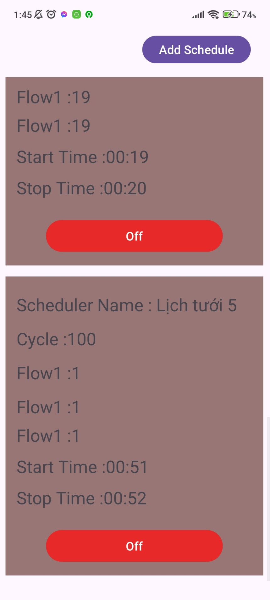
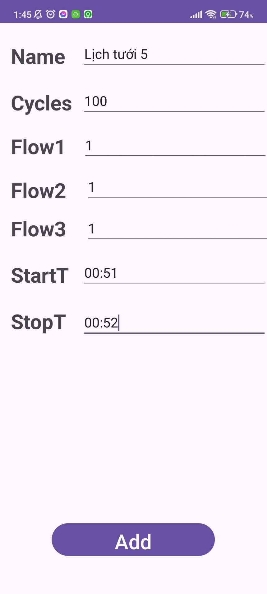

# BTL-IOT-SMART-FARM

## Giới thiệu
Dự án BTL-IOT-SMART-FARM là một hệ thống tưới tiêu thông minh sử dụng giao thức MQTT và Modbus để quản lý các thiết bị như máy trộn phân bón, bộ chọn vùng, và bơm nước.

## Yêu cầu hệ thống
- Node.js
- Python
- Thư viện Paho MQTT cho Python
- Thư viện MinimalModbus cho Python

## Cài đặt
1. Cài đặt Node.js từ [Node.js Official Website](https://nodejs.org/)
2. Cài đặt Python từ [Python Official Website](https://www.python.org/)
3. Cài đặt các thư viện Python cần thiết:
    ```sh
    pip install paho-mqtt minimalmodbus
    ```
4. Cài đặt các thư viện Node.js cần thiết:
    ```sh
    npm install mosca express body-parser
    ```
## Hướng dẫn chạy
### Chạy MQTT Server
Để chạy MQTT server cục bộ, mở terminal và chạy lệnh sau:

    node server.js
    

### Chạy SchedulerManager
Để chạy SchedulerManager, mở một terminal khác và chạy lệnh sau:

    python SchedulerManager.py
    
## Ảnh minh họa
### Dưới đây là một số hình ảnh minh họa ứng dụng:
<div style="display: flex; justify-content: space-around;">
    
    
</div>

